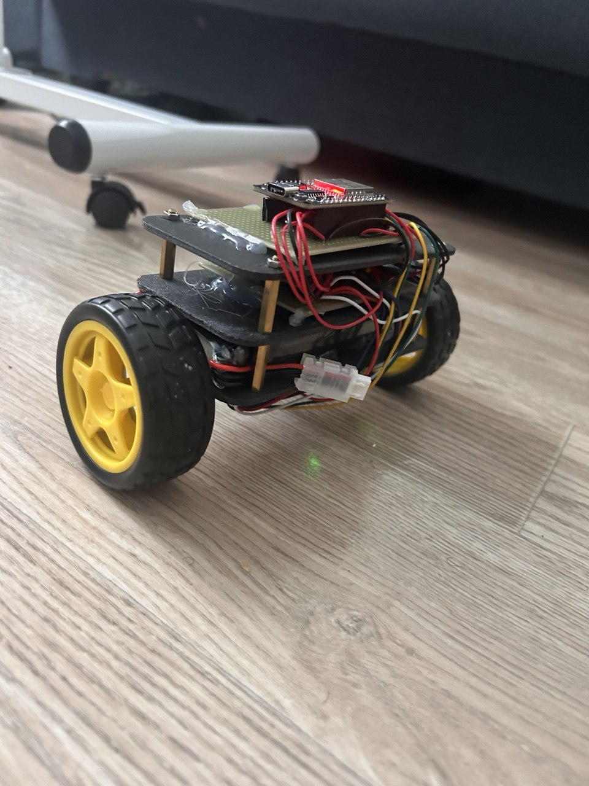
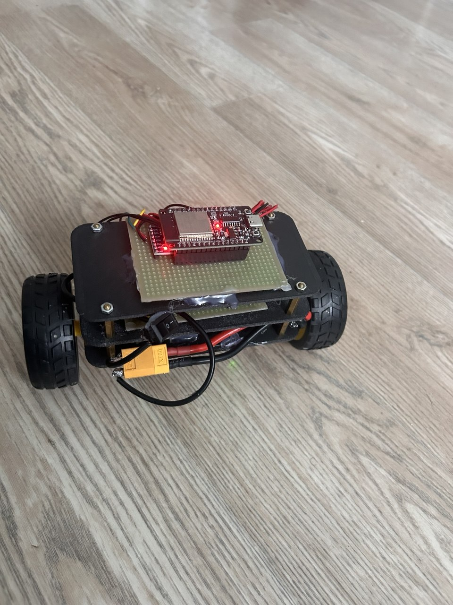
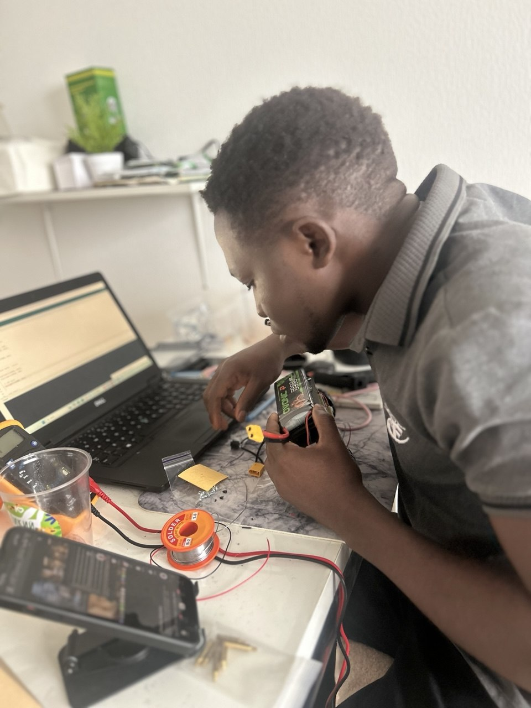

# Self-Balancing Robot

An ESP32-based self-balancing robot built using an **MPU6050 IMU, TB6612FNG motor driver, wheel encoders, complementary filtering, and cascaded PID control**.

The project focuses on modular embedded software architecture and real-time feedback control.

#Robot
<p align="center">
  
  
</p>

## Highlights

* **ESP32** real-time control
* **MPU6050** sensor integration via I²C
* Complementary filter for tilt estimation
* Wheel encoder feedback for velocity measurement
* Cascaded **velocity PI + angle PID** control
* TB6612FNG dual motor control with PWM
* Gyroscope calibration and sensor-failure handling
* Fall-angle safety cutoff
* Modular C++ architecture

## Architecture

```text
MPU6050
   │
   ▼
Complementary Filter
   │
   ▼
Robot Angle ───────────────┐
                           ▼
Encoders → Velocity PI → Target Angle
                           │
                           ▼
                       Angle PID
                           │
                           ▼
                      Motor Power
                           │
                           ▼
                       TB6612FNG
                           │
                           ▼
                         Motors
```

## Project Structure

```text
SelfBalancingRobot/
│
├── SelfBalancingRobot.ino
├── config.h
│
├── sensors/
│   ├── MPU6050.h
│   └── MPU6050.cpp
│
├── motors/
│   ├── MotorController.h
│   └── MotorController.cpp
│
├── encoders/
│   ├── Encoders.h
│   └── Encoders.cpp
│
└── control/
    ├── ComplementaryFilter.h
    ├── ComplementaryFilter.cpp
    ├── AnglePID.h
    ├── AnglePID.cpp
    ├── VelocityController.h
    └── VelocityController.cpp
```

## Hardware

* ESP32
* MPU6050
* TB6612FNG
* 2× DC geared motors
* 2× wheel encoders

## Control Approach

The robot uses a **cascaded feedback architecture**:

**Outer loop**

```text
Wheel Velocity → PI Controller → Target Angle
```

**Inner loop**

```text
Target Angle + Measured Angle → PID → Motor Power
```

The complementary filter combines accelerometer and gyroscope measurements to provide the angle used by the inner control loop.

## Configuration

Controller gains, hardware pins, encoder direction, filter parameters, and safety limits are centralized in:

```text
config.h
```

This keeps hardware configuration and controller tuning separate from the implementation.

---
<p align="center">
  
</p>
**Embedded systems • Robotics • Sensor Fusion • Feedback Control • C++ • ESP32**
